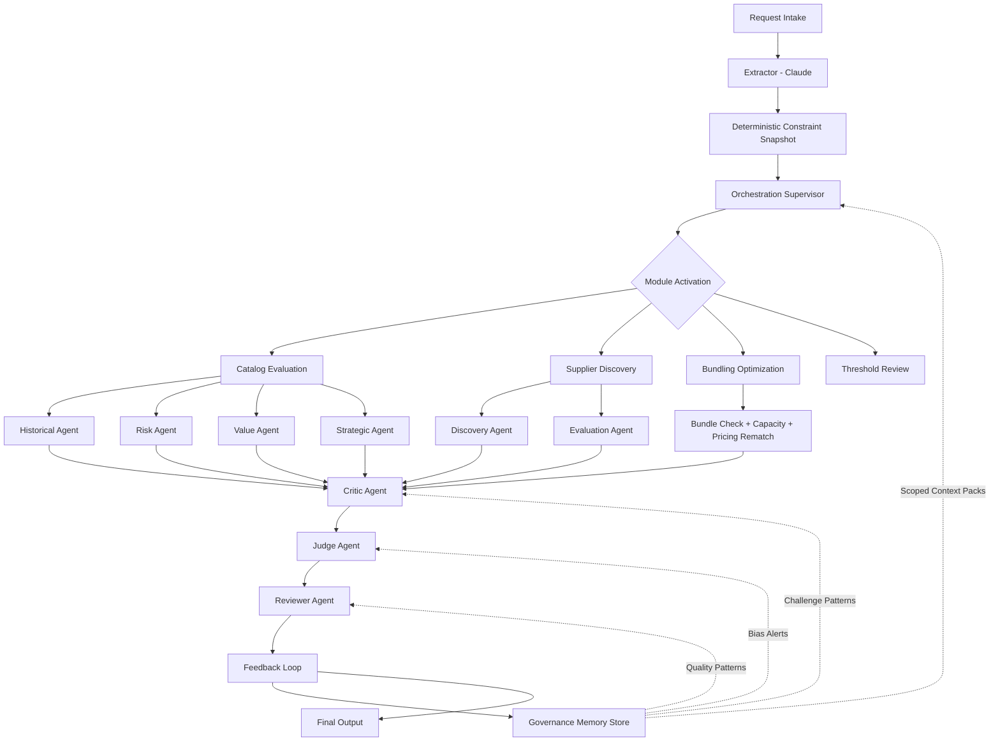

# ChainIQ — Audit-Ready Autonomous Sourcing Agent

> START Hack 2026 — ChainIQ Challenge

An AI-powered procurement sourcing agent with universal orchestration governance. Every request flows through a Supervisor → Specialists → Critic → Judge → Reviewer pipeline with no decision branch that bypasses agentic reasoning.

## Quick Start

```bash
# Backend (port 8000)
export ANTHROPIC_API_KEY="sk-ant-..."
python -m venv venv && source venv/bin/activate
pip install -r requirements.txt
python -m uvicorn backend.main:app --host 0.0.0.0 --port 8000 --reload

# Frontend (port 3000)
cd frontend
npm install
npm run dev
```

Open http://localhost:3000

## Architecture: Universal Orchestration



**Core principle**: Deterministic rules (thresholds, restrictions, escalations) are authoritative constraints but inputs to orchestration, not replacements for it. No request bypasses agentic reasoning. The Judge agent produces the final ranking — no hard-coded scoring blend.

## Pipeline: Universal Backbone

Every request flows through:

1. **Constraint Snapshot** — deterministic: filter suppliers, get pricing, validate, evaluate policies, check escalations, detect catalog gaps, detect bundle opportunities
2. **Activation Plan** — supervisor decides which modules to activate based on signals
3. **Specialist Modules** — only relevant agents run:
   - **Catalog Evaluation**: Historical, Risk, Value, Strategic agents (in parallel, independently)
   - **Supplier Discovery**: Discovery + Evaluation agents (when no approved supplier exists)
   - **Bundling Optimization**: volume aggregation, capacity check, pricing tier rematch
   - **Threshold Review**: agent-informed approval decisions
4. **Critic Agent** — challenges specialist outputs for contradictions, weak evidence, bias
5. **Judge Agent** — resolves disagreements, de-biases, produces final ranking with justification
6. **Reviewer Agent** — verifies consistency, evidence quality, audit-readiness
7. **Feedback Loop** — writes structured governance memory for future runs
8. **Final Output** — fully traced, governed, audit-ready

## Governance Layer

| Agent | Role | Always Runs? |
|-------|------|--------------|
| **Critic** | Finds contradictions, weak evidence, anchoring bias in specialist outputs | Yes |
| **Judge** | Final adjudicator — resolves disagreements, produces definitive ranking | Yes |
| **Reviewer** | Verifies audit-readiness, flags evidence gaps, signs off | Yes |

### Governance Memory (Scoped)

| Recipient | Memory Type | Examples |
|-----------|------------|----------|
| Supervisor | Process memory | Routing mistakes, activation heuristics |
| Critic | Challenge patterns | Recurring contradictions, weak evidence |
| Judge | Governance memory | Bias alerts, confidence calibration |
| Reviewer | Quality-control | Audit defects, missing traceability |
| Specialists | Narrow checklists only | Pricing sanity, sparse-data risk |

Memory is structured, typed, scoped, and auditable. Context packs inject only relevant memory into each governance agent.

## Module Activation

The Supervisor activates modules based on constraint snapshot signals:

| Module | Trigger | Agents |
|--------|---------|--------|
| `catalog_evaluation` | Always (if eligible suppliers exist) | Historical, Risk, Value, Strategic |
| `new_supplier_discovery` | No eligible suppliers (catalog gap) | Discovery, Evaluation |
| `bundling_optimization` | Bundle opportunity detected | Value, Risk, Strategic |
| `threshold_approval_review` | Multi-quote or deviation required | Risk, Strategic |
| `escalation_review` | Any escalation triggered | — |

## Bundling Subflow

```
detect_bundle_opportunity()
  → hold-window feasible? (SLA check, 7-day minimum)
    → NO: direct fulfillment
    → YES: volume aggregation
      → capacity check (bundled qty vs supplier capacity)
        → EXCEEDED: ER-009 escalation
        → OK: pricing tier rematch → threshold review
```

## Frontend: 5 Tabs with On-Demand Traceability

1. **Recommendation** — status, activated modules, judge ranking with justifications, reviewer audit-ready badge, approval routing
2. **Process Trace** — timeline of every orchestration step with type badges (deterministic/agentic/governance), durations, bundling/discovery details
3. **Agent Logic** — per-agent cards with purpose, inputs, logic rubric, rankings, independence confirmation
4. **Governance** — critic findings, judge disagreement resolutions, bias checks, reviewer feedback, governance memory summary
5. **Audit Trail** — validation issues, escalations, policy evaluation, data sources, excluded suppliers

## Escalation Rules

| Rule | Trigger | Routes To | Blocking |
|------|---------|-----------|----------|
| ER-001 | Missing info / budget insufficient | Requester | Yes |
| ER-002 | Preferred supplier restricted | Procurement Manager | Yes |
| ER-003 | High-value threshold | Head of Strategic Sourcing | No |
| ER-004 | No compliant supplier / lead times infeasible | Head of Category | Yes |
| ER-005 | Data residency unmet | Security & Compliance | Yes |
| ER-006 | Quantity exceeds all capacity | Sourcing Excellence Lead | No |
| ER-007 | Marketing/Influencer category | Marketing Governance Lead | No |
| ER-008 | Supplier not registered in country | Regional Compliance Lead | No |
| ER-009 | Bundle capacity exceeded | Sourcing Excellence Lead | No |
| ER-010 | Critic high-severity finding | Governance Review | Yes |

## API Endpoints

```
GET  /api/requests                  List/filter all 304 requests
GET  /api/requests/{id}             Single request details
POST /api/analyze/{id}              Universal orchestration pipeline
POST /api/analyze/custom            Analyze free-text input
GET  /api/stats                     Dashboard aggregate stats
GET  /api/health                    Health check
```

## Project Structure

```
backend/
├── services/
│   ├── supervisor.py               # Universal orchestration core
│   ├── pipeline.py                 # Entry points (delegates to supervisor)
│   ├── orchestrator.py             # Specialist agent runner
│   ├── rule_engine.py              # Validation + policy evaluation
│   ├── supplier_filter.py          # Filtering + gap/bundle detection
│   ├── escalation.py               # 10 escalation rules
│   ├── confidence.py               # Confidence scoring
│   ├── explainer.py                # Audit explanation generation
│   ├── extractor.py                # Requirement extraction
│   ├── governance_memory.py        # Scoped governance memory store
│   ├── context_pack_builder.py     # Context packs for governance agents
│   ├── feedback_loop.py            # Feedback → memory entries
│   ├── agents/
│   │   ├── base.py                 # BaseAgent with Claude client
│   │   ├── historical_agent.py     # Historical precedent
│   │   ├── risk_agent.py           # Risk assessment
│   │   ├── value_agent.py          # Value-for-money
│   │   ├── strategic_agent.py      # Strategic fit
│   │   ├── critic_agent.py         # Challenges specialist outputs
│   │   ├── judge_agent.py          # Final adjudicator
│   │   ├── reviewer_agent.py       # Audit-readiness verifier
│   │   ├── discovery_agent.py      # Catalog gap handling
│   │   └── evaluation_agent.py     # New supplier evaluation
│   └── modules/
│       ├── catalog_module.py       # Approved-supplier evaluation
│       ├── discovery_module.py     # Supplier discovery
│       ├── bundling_module.py      # Volume optimization
│       └── threshold_module.py     # Approval review
frontend/
├── app/
│   ├── page.tsx                    # Dashboard
│   └── request/[id]/page.tsx       # 5-tab analysis view
└── lib/
    ├── types.ts                    # TypeScript interfaces
    └── api.ts                      # API client
```

## Efficiency & Anti-Bias Safeguards

- Specialists evaluate independently (don't see each other's outputs)
- Critic runs AFTER specialists, not before
- Judge sees ALL outputs — is the ONLY component that produces final ranking
- Reviewer sees final package only, not raw specialist reasoning
- Only relevant specialists run per module
- Supervisor coordinates but does NOT make final recommendation
- Deterministic rules remain non-overridable where blocking
- Governance memory is structured, typed, scoped — not free-form shared memory
- Frontend exposes structured reasoning artifacts, NOT private chain-of-thought
